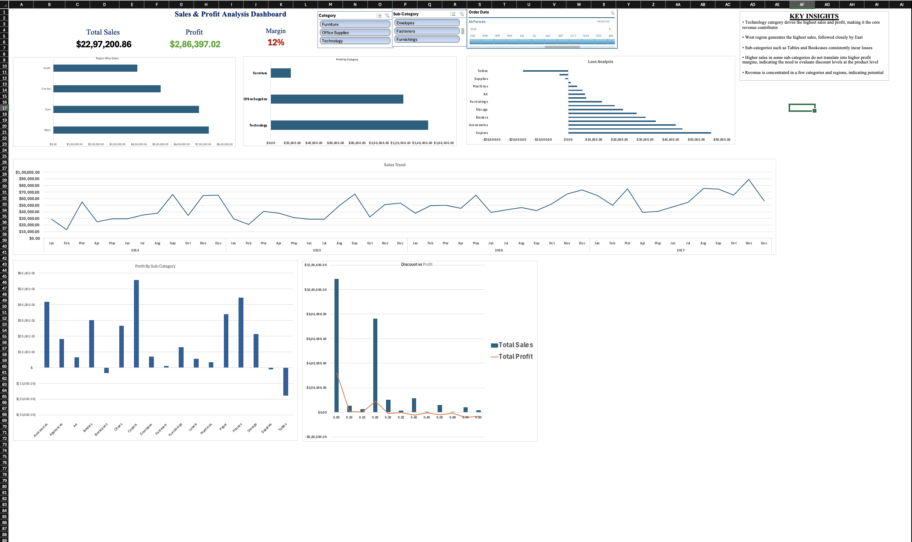

# Sales & Profit Analysis Dashboard (Excel)

# Project Overview

This project is an interactive Excel dashboard built to analyze sales, profit, and margin across different regions, categories, and time periods. It enables dynamic filtering and helps identify key business insights for decision-making.

---

# Tools & Techniques Used

* Microsoft Excel
* Pivot Tables & Pivot Charts
* Slicers & Timeline
* Data Cleaning & Transformation
* Data Visualization

---

# Key Features

* Interactive dashboard with dynamic filtering
* Region-wise sales analysis
* Profit analysis by category and sub-category
* Sales trend over time
* Discount vs Profit analysis

---

# Key Insights

* Technology category drives the highest sales and profit
* West region contributes the most revenue
* Sub-categories such as Tables show consistent losses
* High sales do not always result in high profitability
* Discounting negatively impacts profit margins

---

# Dashboard Preview

---

# Download Dashboard

[Download Excel File](./Sales_Profit_Dashboard.xlsx)

---

# Files Included

* Sales_Profit_Dashboard.xlsx
* dashboard.png

---

# Conclusion

This project demonstrates how Excel can be used for data analysis, dashboard creation, and deriving actionable business insights.
